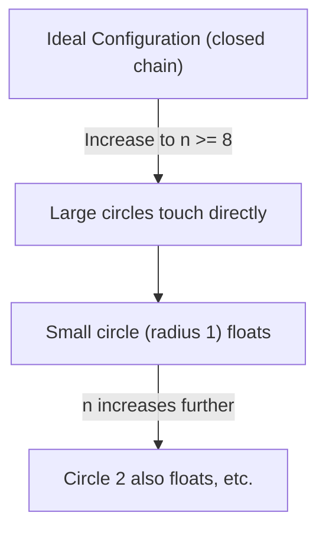

# ringmin

Exact solver and certificate artifacts for the minimum central circle problem:
circles of radii `1,2,...,n` are externally tangent to a central circle, and the
goal is to minimize the central radius `R`.

> 🇮🇹 Per una spiegazione semplice e non tecnica del problema e dei risultati del paper, consulta il documento [SPIEGAMI.md](file:///c:/Users/Falker/Desktop/Code/circle/ringmin/SPIEGAMI.md).


The repository certifies the global optimum for `n=3..14` by exhaustive
enumeration of cyclic orderings. The fixed-order feasibility oracle is a
high-precision Simple Temporal Network check over all pairwise angular
constraints; chain-only values are used only as lower bounds.

## Endorser-Facing Summary

This project studies a finite geometric optimization problem about arranging
circles of radii `1,2,...,n` around a central circle while minimizing the
central radius. The paper proves that the chain-ordering lower-bound problem is
a fixed Supnick/anti-Monge TSP, then uses explicit certificate artifacts and an
independent verifier to certify global optima for `3 <= n <= 14`. Results for
larger `n` are reported only as heuristic evidence and conjectural structure.

## The Minimum Central Circle Problem: An Intuitive Explainer

Welcome! If you are wondering what this research is about without getting bogged down in complex mathematical formulas, this guide is for you. Here we explain how an apparently simple geometric puzzle hides fascinating connections with computer optimization and circle packings.

---

### 1. The Starting Puzzle: The Circle "Necklace"

Imagine having a central circle of radius $R$ (which we want to minimize) lying on a table.
Around it, we want to place a set of other circles, each of a different size:
* The first has radius $1$
* The second has radius $2$
* The third has radius $3$
* ... and so on, up to a large circle of radius $n$.

All these outer circles must touch the central circle (i.e., be externally tangent to it) and be arranged next to each other like beads on a necklace, wrapping around it without overlapping.

> [!IMPORTANT]
> **The Core Question:**  
> In what order should we arrange these outer circles to make the central circle **as small as possible**?

At first glance, this seems like a recreational geometric puzzle. But the math becomes interesting as soon as we ask: *why should one order be better than another?*

---

### 2. Angular Space and the Central Radius ($R$)

Each outer circle touches the central circle. The closer they are, the more "angular space" they consume around the center.
* A full loop around the central circle always measures **360 degrees** (or $2\pi$ radians).
* If two adjacent outer circles are large, they consume a lot of angular space.
* If one is small and one is large, they consume an intermediate amount.
* If both are small, they consume very little space.

This is where the central radius ($R$) comes in:
* If the central circle is **large**, the outer circles are pushed further apart, reducing the angle they require.
* If the central circle is **small**, the outer circles crowd closer together, increasing the required angles.

Thus, minimizing the central radius means **finding the circle ordering that requires the least amount of angular space**. If we find the perfect order, we can shrink the central circle to its absolute minimum while still closing the necklace around it.

---

### 3. An Unexpected Connection: The Traveling Salesperson Problem (TSP)

This is where geometry meets computer science. There is a classic optimization problem called the **Traveling Salesperson Problem (TSP)**:
> Given a list of cities and the distances between each pair, what is the shortest possible route that visits each city exactly once and returns to the origin city?

In our case:
* The **"cities"** are our outer circles of radius $1, 2, \dots, n$.
* The **"road distance"** (or cost) between two circles is the minimum angle they require to sit next to each other without overlapping.

Choosing the best order of the circles is mathematically identical to finding the shortest tour for the traveling salesperson: we want to find a cycle visiting all circles that minimizes the total cost (the sum of the consecutive angles).

---

### 4. The Mathematical Shortcut: Supnick and the Anti-Monge Structure

Generally, the Traveling Salesperson Problem is extremely hard to solve (it is a problem *NP-hard*). As the number of cities increases, the number of possible routes explodes, and even supercomputers cannot find the perfect solution in a reasonable time.

However, a special mathematical property arises in our problem: the "cost table" (the angles between circles) is not arbitrary. It exhibits a structured pattern known as an **anti-Monge matrix**.
Simply put, the costs follow a highly regular progression because the circles are sorted by size.

Thanks to this regularity, we can apply **Supnick's Theorem**:
> [!TIP]
> Supnick's Theorem proves that for anti-Monge matrices, we do not need to search through billions of permutations. The optimal ordering is pre-determined and follows a specific **pyramid-like shape** (for instance, alternating large and small circles in a structured pattern to balance the costs).

This is the **first key contribution** of our work: we proved that the optimal chain ordering is not just an intuitive guess, but is rigorously governed by a hidden anti-Monge structure via Supnick's Theorem.

---

### 5. The Real Geometry: Chain Breakdown and "Floating Circles"

So far, so good. But real geometry on the 2D plane is trickier than just adjacent links in a chain.
The chain equations only ensure that circle $A$ does not overlap $B$, and $B$ does not overlap $C$. But what if circle $A$ and circle $D$ collide across the layout?

As the number of outer circles increases (starting exactly at **$n = 8$**), a strange phenomenon occurs:
* The large circles on either side of the smallest circle (radius $1$) are so bulky that they touch each other *over* the small circle.
* Circle $1$ is literally **squeezed out** of the main chain. It remains tangent to the central circle, but no longer acts as an essential separator between its neighbors.

We call this a **"Floating Circle"**.



As $n$ grows, this effect cascades: first circle $1$ floats, then circle $2$, and so on, progressively breaking the simple chain topology.

---

### 6. Constraint Check and Global Certification

To handle this behavior and find the true optimum, we can no longer just look at adjacent circles. We must enforce non-overlap constraints on **all pairs of circles simultaneously**.

Our approach does this by:
1. Describing the position of each outer circle by an angle.
2. Formulating a system of inequalities: *"the angular distance between circle $X$ and circle $Y$ must be at least the value required to prevent overlap"*.
3. Solving this system to check if a configuration is geometrically realizable.

### How do we certify the global optimum for $n$ up to 14?
For $n=14$, the number of cyclic orderings is huge (billions of candidate solutions). To prove that our solution is the absolute best:
1. **Lower Bound Pruning:** For every possible order, we compute a relaxed, optimistic lower bound of the required central radius. If this bound is already worse than the best radius we have found, we prune (discard) that order immediately.
2. **Full Geometric Feasibility:** For the few competitive orderings that survive pruning, we verify feasibility using all pairwise angular constraints.
3. **Certified Result:** This process guarantees that all other billions of orders are either explicitly checked or mathematically proven to be worse, certifying the global optimum.

---

### 7. Connection to Classical Circle Packings

Another fascinating perspective (brought to our attention by mathematician **Daniel Mathews** during the arXiv endorsement process) connects this problem to the classical theory of **Circle Packings**.

The classical **Descartes Circle Theorem** allows one to compute the radius of a fourth circle tangent to three mutually tangent circles. One might think to solve our problem using algebraic circle packing equations.
However, there is a fundamental difference:
* Classical circle packing theory assumes a pre-determined contact graph (we know which circle touches which).
* In our problem, we must **find the optimal ordering**, which changes with $n$. Moreover, the appearance of floating circles dynamically alters the contact graph.

Our method, by splitting the problem into two stages (Supnick TSP optimization + pairwise angular feasibility), solves this specific problem much more directly and efficiently.

---

### 8. Key Contributions of the Work

In summary, this research makes three main contributions:

1. **Theoretical:** Connected a geometric circle problem to combinatorial optimization (TSP), explaining the optimal pyramid order through Supnick's theorem and anti-Monge matrices.
2. **Geometric:** Discovered and characterized the breakdown of the chain topology and the emergence of the **floating circle cascade** for $n \ge 8$.
3. **Computational:** Developed a verified search algorithm and provided open-source code and data that **certify the global optima** for all non-trivial cases up to $n = 14$.

---

## Environment


The submission-gate environment is pinned in `requirements.txt` and was:

- Python `3.14.3`
- `numpy==2.4.3`
- `scipy==1.17.1`
- `mpmath==1.3.0`
- `matplotlib==3.10.9`
- `pytest==9.0.2`

Install:

```bash
python -m pip install -r requirements.txt
python -m pip install -e ".[test]"
```

`pyproject.toml` intentionally leaves runtime dependencies unpinned for normal
editable development; use `requirements.txt` for the exact submission
reproduction environment.

## Quick Verification

These checks are intended for a quick local or CI smoke test. They do not
regenerate the long-run certificates.

```bash
python -m pip install -r requirements.txt
python -m pip install -e ".[test]"
python -m pytest
python verify.py --start 3 --stop 8 --skip-frontier
```

The smoke verifier skips the frontier/progress-log audit because
`results/checkpoints/` is intentionally not tracked in git.

If a LaTeX distribution with `pdflatex` is available, compile the paper with:

```bash
pdflatex -interaction=nonstopmode -halt-on-error -output-directory=paper_assets paper_assets/ringmin_paper.tex
pdflatex -interaction=nonstopmode -halt-on-error -output-directory=paper_assets paper_assets/ringmin_paper.tex
```

## Certified Results

The 30-digit values are generated in `results/highprec.csv` and copied into
`paper_assets/appendix_tables.tex`.

| n | R* | optimal cycle | floaters |
|---:|---|---|---|
| 3 | 0.260869565217391304347826086957 | `[3, 1, 2]` | `{}` |
| 4 | 0.844453589560855604347528524674 | `[4, 1, 3, 2]` | `{}` |
| 5 | 1.69549408120271081351328017371 | `[5, 1, 4, 3, 2]` | `{}` |
| 6 | 2.79491951889692485617024406797 | `[6, 1, 5, 3, 4, 2]` | `{}` |
| 7 | 4.15318955374381246513863858202 | `[7, 1, 6, 3, 4, 5, 2]` | `{}` |
| 8 | 5.7677942845896143026361805725 | `[8, 1, 6, 4, 5, 3, 7, 2]` | `{1}` |
| 9 | 7.72672655261128921886246177604 | `[9, 2, 8, 1, 5, 6, 4, 7, 3]` | `{1}` |
| 10 | 9.97990738586347760966552641468 | `[10, 2, 9, 4, 7, 1, 6, 5, 8, 3]` | `{1}` |
| 11 | 12.4887204871876588517468786264 | `[11, 2, 10, 4, 8, 6, 7, 1, 5, 9, 3]` | `{1}` |
| 12 | 15.2588704304484933617250043503 | `[12, 2, 11, 4, 9, 6, 7, 8, 5, 1, 10, 3]` | `{1}` |
| 13 | 18.3175630472173206282821941532 | `[13, 3, 1, 12, 2, 10, 6, 8, 7, 9, 5, 11, 4]` | `{1}` |
| 14 | 21.6653951822145150956462891793 | `[14, 3, 13, 2, 9, 8, 7, 10, 6, 11, 5, 1, 12, 4]` | `{1,2}` |

Certified means global optimality up to absolute tolerance `1e-10` in `R`.
The bisection tolerances are `1e-12`/`1e-13`, and the displayed binding
structures are rechecked to 50 decimal digits.

## Submission-Gate Verification

Run the independent verifier:

```bash
python verify.py --start 3 --stop 14
```

`verify.py` imports only the Python standard library and `mpmath`. It does not
import `src/ringmin`. It checks three layers for every certified `n`:

1. Incumbent feasibility: reloads `results/nNN/optimum.json`, rebuilds the
   theta matrix at 50 digits, checks the saved witness angles, all pairwise
   angular constraints, Cartesian non-overlap, essential pairs, and floating
   circles.
2. Local optimality for the incumbent order: verifies feasibility at
   `R* + 1e-12` and infeasibility at `R* - 1e-12`.
3. Global pruning certificate: reloads `results/frontiers/nNN_frontier.json`,
   verifies enumeration counts, canonicalization metadata, progress-log proof,
   frontier hash, top-excluded guard, and recomputes every frontier lower bound
   at 50 digits.

Current verifier summary:

```text
n=03 incumbent=PASS local=PASS frontier=PASS eta=1.0e-12 frontier_size=1 total=1
n=04 incumbent=PASS local=PASS frontier=PASS eta=1.0e-12 frontier_size=1 total=3
n=05 incumbent=PASS local=PASS frontier=PASS eta=1.0e-12 frontier_size=1 total=12
n=06 incumbent=PASS local=PASS frontier=PASS eta=1.0e-12 frontier_size=1 total=60
n=07 incumbent=PASS local=PASS frontier=PASS eta=1.0e-12 frontier_size=1 total=360
n=08 incumbent=PASS local=PASS frontier=PASS eta=1.0e-12 frontier_size=1 total=2520
n=09 incumbent=PASS local=PASS frontier=PASS eta=1.0e-12 frontier_size=1 total=20160
n=10 incumbent=PASS local=PASS frontier=PASS eta=1.0e-12 frontier_size=4 total=181440
n=11 incumbent=PASS local=PASS frontier=PASS eta=1.0e-12 frontier_size=6 total=1814400
n=12 incumbent=PASS local=PASS frontier=PASS eta=1.0e-12 frontier_size=9 total=19958400
n=13 incumbent=PASS local=PASS frontier=PASS eta=1.0e-12 frontier_size=10 total=239500800
n=14 incumbent=PASS local=PASS frontier=PASS eta=1.0e-12 frontier_size=11 total=3113510400
```

The n=14 frontier was extracted from the existing `K=50000` checkpoint heaps;
no Stage-A rerun was needed.

## Full Certification And Regeneration

The following commands are for full audit or artifact regeneration. They are not
CI checks: the certified sweeps, especially `n=13` and `n=14`, are long-running
jobs.

Run tests:

```bash
python -m pytest
```

Regenerate certified searches:

```bash
python scripts/sweep_certified.py --start 3 --stop 13 --k 20000 --workers 8 --resume
powershell -ExecutionPolicy Bypass -File scripts/start_detached_sweep.ps1 -Start 14 -Stop 14 -K 50000 -Workers 8 -Resume
```

Run the full independent certificate verifier:

```bash
python verify.py --start 3 --stop 14
```

Regenerate high-precision values and certificate metadata:

```bash
python scripts/highprec_verify.py --start 3 --stop 14 --digits 50
```

Regenerate frontier certificates:

```bash
python scripts/extract_frontiers.py --start 3 --stop 14 --margin 2e-10
```

Run the float64-vs-mpmath calibration:

```bash
python scripts/calibrate_float64.py --start 8 --stop 14 --samples 100000 --workers 8 --batch-size 500
```

The current global maximum absolute deviation is
`1.75137506176142662e-14`, below the `1e-11` submission threshold.

Regenerate paper tables, figures, and report artifacts:

```bash
python scripts/refresh_heuristic_artifacts.py
python scripts/free_float_criterion.py
python scripts/patterns_table.py
python scripts/supnick_validity.py
python scripts/asymptotic_fit.py
python scripts/generate_figures.py
python scripts/build_report.py
python scripts/export_paper_assets.py
```

Compile the paper:

```bash
pdflatex -interaction=nonstopmode -halt-on-error -output-directory=paper_assets paper_assets/ringmin_paper.tex
pdflatex -interaction=nonstopmode -halt-on-error -output-directory=paper_assets paper_assets/ringmin_paper.tex
```

## Run Logs And Data-Generation Hash

The M6 artifacts record `generation_commit_hash` in every
`results/nNN/optimum.json`. The current data-generating commit recorded there is:

```text
fea000523a1ec4193d8ba9c4637563fd65e86d1a
```

Long-run evidence:

- n=13 progress log: `results/checkpoints/progress_n13_lb3.log`
- n=14 progress log: `results/checkpoints/progress_n14_lb3.log`
- n=14 detached stdout: `results/logs/sweep_14_14_20260610_221502.out.log`
- n=14 detached stderr: `results/logs/sweep_14_14_20260610_221502.err.log`

Checkpoint `.pkl` files under `results/checkpoints/` are intentionally ignored
because they are large and regenerated by `--resume`; the frontier JSON files
under `results/frontiers/` are the portable pruning certificates.

## Workflow And AI Assistance

The project was built in an AI-assisted workflow under the author's direction
and final review. AI assistance supported research design, mathematical
argument development, software implementation, tests, scripts, and repository
artifacts. All certified numerical claims are backed by the independent
`verify.py` verifier and the saved result artifacts.

## Layout

- `src/ringmin/`: solver library and CLI.
- `tests/`: pytest coverage for geometry, evaluator, search, patterns, and SLSQP
  cross-validation.
- `scripts/`: reproducibility and artifact-generation scripts.
- `verify.py`: standalone mpmath/stdlib-only certificate verifier.
- `results/`: certified optima, frontier certificates, calibration data, and logs.
- `figures/`: regenerated per-n figures.
- `paper_assets/`: paper source, PDF, figures, tables, and appendix snippets.

## License

MIT - see `LICENSE`.
