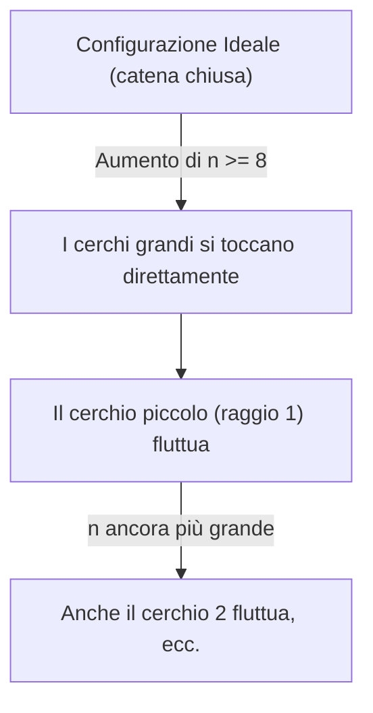

# Il Problema dei Cerchi Concentrici: Una Guida Semplice e Non Tecnica

Benvenuto! Se ti stai chiedendo di cosa parli questa ricerca senza voler affogare in formule matematiche complesse, questa è la guida giusta per te. Qui spieghiamo come un puzzle geometrico apparentemente semplice nasconda in realtà collegamenti affascinanti con l'ottimizzazione computazionale e la geometria dei cerchi.

---

## 1. Il Puzzle di Partenza: La "Collana" di Cerchi

Immagina di avere sul tavolo un cerchio centrale di raggio ancora da definire ($R$).
Intorno a questo cerchio centrale, vuoi disporre una serie di altri cerchi, ognuno di dimensione diversa:
* Il primo ha raggio $1$
* Il secondo ha raggio $2$
* Il terzo ha raggio $3$
* ... e così via, fino a un cerchio di raggio $n$.

Tutti questi cerchi esterni devono toccare il cerchio centrale (cioè essere tangenti ad esso) e disporsi l'uno accanto all'altro come le perle di una collana, girandogli attorno senza sovrapporsi.

> [!IMPORTANT]
> **La Domanda Chiave:**  
> In quale ordine dobbiamo disporre questi cerchi esterni per fare in modo che il cerchio centrale sia **il più piccolo possibile**?

A prima vista sembra un gioco o un passatempo geometrico. Ma la matematica diventa interessante non appena ci chiediamo: *perché un ordine dovrebbe essere migliore di un altro?*

---

## 2. Lo "Spazio Angolare" e il Raggio Centrale ($R$)

Ogni cerchio esterno tocca il cerchio centrale. Più i cerchi esterni sono vicini, più "consumano" angolo attorno al centro.
* Il giro completo attorno al cerchio centrale misura sempre **360 gradi** (ovvero $2\pi$ radianti).
* Se due cerchi esterni consecutivi sono grandi, consumano molto spazio angolare.
* Se un cerchio è piccolo e uno è grande, consumano uno spazio intermedio.
* Se entrambi sono piccoli, consumano poco spazio angolare.

Qui entra in gioco il raggio del cerchio centrale ($R$):
* Se il cerchio centrale è **grande**, i cerchi esterni sono posizionati più lontani tra loro e l'angolo di cui hanno bisogno si riduce.
* Se il cerchio centrale è **piccolo**, i cerchi esterni si stringono attorno ad esso e l'angolo richiesto aumenta.

Quindi, minimizzare il raggio centrale significa **trovare l'ordine dei cerchi che richiede meno spazio angolare possibile**. Se troviamo l'ordine perfetto, potremo rimpicciolire il cerchio centrale al massimo, mantenendo comunque la collana chiusa attorno ad esso.

---

## 3. Un Collegamento Inatteso: Il Commesso Viaggiatore (TSP)

Qui la geometria incontra l'informatica e l'ottimizzazione combinatoria. Esiste un problema classico chiamato **Travelling Salesman Problem (TSP)** (in italiano, il *Problema del Commesso Viaggiatore*):
> Dato un gruppo di città e le distanze stradali tra di esse, qual è il percorso più breve per visitarle tutte una volta sola e tornare al punto di partenza?

Nel nostro caso:
* Le **"città"** sono i nostri cerchi esterni di raggio $1, 2, \dots, n$.
* Il **"costo"** (o la distanza) tra due cerchi è l'angolo minimo di cui hanno bisogno per stare vicini senza sovrapporsi.

Scegliere l'ordine dei cerchi è esattamente come pianificare il viaggio del commesso viaggiatore: vogliamo trovare il percorso (l'ordine) che minimizza il costo totale (la somma degli angoli richiesti).

---

## 4. La Scorciatoia Matematica: Supnick e la Struttura Anti-Monge

Di solito il problema del commesso viaggiatore è difficilissimo da risolvere (è un problema *NP-difficile*): quando il numero di città aumenta, le combinazioni possibili esplodono e nemmeno i supercomputer riescono a trovare la soluzione perfetta in tempi ragionevoli.

Ma nel nostro problema accade qualcosa di speciale. La tabella dei "costi" (gli angoli tra i cerchi) non è casuale. Ha una struttura geometrica regolare chiamata **anti-Monge**.
In parole semplici, significa che i costi seguono una regolarità matematica molto forte dovuta al fatto che i cerchi sono ordinati per dimensione.

Grazie a questa struttura, possiamo applicare il **Teorema di Supnick**:
> [!TIP]
> Il Teorema di Supnick dimostra che, per le matrici anti-Monge, non serve cercare tra miliardi di combinazioni. Esiste un ordine ottimale teorico già scritto, che ha una tipica forma **a piramide** (ad esempio, alternando elementi grandi e piccoli in modo strutturato per bilanciare i costi).

Questo è il **primo grande contributo** del lavoro: abbiamo dimostrato che l'ordine ottimale per la catena di cerchi non è solo un'intuizione visiva o un tentativo fortunato, ma è rigorosamente governato da una struttura matematica nascosta tramite il Teorema di Supnick.

---

## 5. La Geometria Reale: Il Collasso della Catena e i "Cerchi Flottanti"

Fin qui tutto sembra risolto. Ma la geometria reale del piano è più complessa della sola teoria delle catene consecutive.
L'equazione della catena controlla solo che ciascun cerchio non si sovrapponga al precedente e al successivo. Ma cosa succede se due cerchi non consecutivi si scontrano nello spazio?

Quando il numero di cerchi esterni cresce (a partire da **$n = 8$**), succede qualcosa di inatteso:
* I cerchi grandi ai lati del cerchio più piccolo (quello di raggio $1$) sono così ingombranti che tendono a toccarsi tra loro sopra la testa di quest'ultimo.
* Il cerchio $1$ viene letteralmente **spremuto fuori** dalla catena principale. Rimane tangente al cerchio centrale, ma non serve più a tenere distanziati i suoi vicini.

Questo fenomeno viene definito **"Cerchio Flottante"** (*floating circle*).

Con l'aumentare di $n$, questo effetto si propaga (effetto cascata): prima fluttua il cerchio $1$, poi il cerchio $2$, e così via.

---

## 6. Il Controllo di Coerenza e la Certificazione Globale

Per gestire questo fenomeno e trovare la vera soluzione ottimale, non possiamo più guardare solo i cerchi vicini. Dobbiamo controllare **tutte le coppie di cerchi contemporaneamente**.

Per fare questo, il progetto:
1. Assegna a ogni cerchio un angolo sul piano.
2. Crea un sistema di vincoli: *"il cerchio $X$ e il cerchio $Y$ devono essere distanti almeno dell'angolo necessario a non sovrapporsi nello spazio reale"*.
3. Risolve questo sistema per verificare se una configurazione è geometricamente realizzabile.

### Come certifichiamo l'ottimo per $n$ da 3 a 14?
Con $n=14$, il numero di combinazioni possibili è gigantesco (miliardi di configurazioni). Per essere sicuri al 100% di aver trovato la soluzione migliore in assoluto (l'ottimo globale):
1. **Calcolo dei Limiti Inferiori:** Per ogni ordine di cerchi, calcoliamo un limite matematico ottimista dello spazio angolare che occuperebbe. Se questo limite è già peggiore della nostra miglior soluzione attuale, quell'ordine viene scartato subito senza ulteriori calcoli.
2. **Verifica Geometrica Completa:** Per i pochi ordini rimasti in gara, verifichiamo la fattibilità geometrica reale con tutti i vincoli di non-sovrapposizione.
3. **Risultato Certificato:** Questo metodo esclude con assoluta certezza tutti gli altri miliardi di ordini possibili, confermando che la soluzione trovata è l'ottimo globale.

---

## 7. Il Collegamento con la Teoria Classica dei "Circle Packings"

Un altro aspetto affascinante emerso durante il lavoro (anche grazie al confronto con il matematico **Daniel Mathews**) riguarda la teoria dei **Circle Packings** (l'impacchettamento di cerchi tangenti).

Esiste un famoso teorema classico, il **Teorema di Descartes**, che permette di calcolare il raggio di un quarto cerchio tangente a tre cerchi noti. Si potrebbe pensare di usare formule simili per risolvere il nostro problema.
Tuttavia, c'è una differenza fondamentale:
* La teoria classica parte da uno schema di contatti già deciso (sappiamo già chi tocca chi).
* Nel nostro problema, dobbiamo **cercare l'ordine migliore** dei cerchi esterni, e questo ordine cambia con $n$. Inoltre, la presenza dei cerchi flottanti rompe lo schema classico delle tangenze.

Il nostro metodo, dividendo il problema in due fasi (ottimizzazione dell'ordine con Supnick + verifica geometrica dei vincoli angolari), risolve questo specifico problema in modo molto più mirato ed efficiente.

---

## 8. I Tre Contributi Chiave del Lavoro

Per riassumere, questo lavoro porta tre risultati principali:

1. **Contributo Teorico:** Abbiamo collegato la geometria dei cerchi all'ottimizzazione combinatoria (TSP), dimostrando perché l'ordine a piramide è quello ottimale grazie a Supnick e alla struttura anti-Monge.
2. **Contributo Geometrico:** Abbiamo scoperto e descritto il fenomeno dei **cerchi flottanti**, ovvero la rottura della catena geometrica per $n \ge 8$.
3. **Contributo Computazionale:** Abbiamo sviluppato un algoritmo e fornito prove matematiche e codice riproducibile che **certificano gli ottimi globali** per tutti i casi da $n=3$ a $n=14$.

---

### In Sintesi
> Abbiamo studiato come disporre cerchi di dimensioni crescenti attorno a un cerchio centrale minimo. Abbiamo dimostrato che l'ordine ottimale è regolato da una precisa struttura matematica (Supnick/anti-Monge), abbiamo scoperto che la geometria reale rompe questo ordine spingendo fuori i cerchi più piccoli (cerchi flottanti), e abbiamo certificato matematicamente e con codice i risultati ottimali fino a 14 cerchi esterni.
